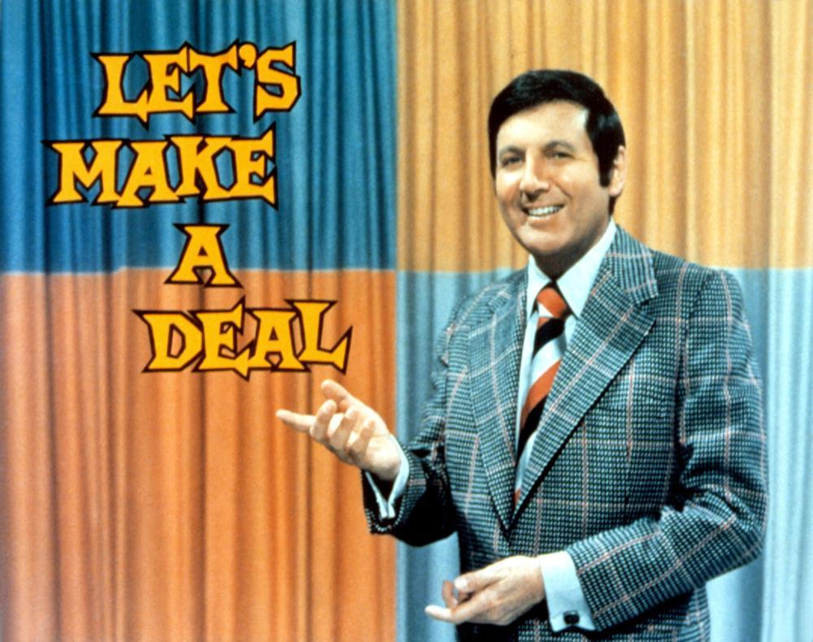

# Introduction {#intro}

`r newthought("Our actions")` are the consequences of our beliefs blending with our desires. I buy some ice cream because I have a *desire* for something sweet and *believe* that ice cream is a good means of satisfying that desire. I take the train to shop downtown because I *believe *the train is an efficient means of transporting me there and I *want* to purchase some things. This way of talking about our actions and choices is sometimes called "belief-desire psychology" and it is a helpful big-picture way of dividing up the parts that make up a decision: we consider a set of possible actions and do the action that best combines our beliefs and desires. If I don't believe the train will get me downtown, or if I don't want to go shopping after all, I won't take it.^[In this way our beliefs are like bets on what the world is (going to be) like. Frank Ramsey (1903-1930), a founder of modern decision theory, suggested this kind of picture.] This picture is misleadingly simple. This chapter gives some brief introductory concepts to refine our understanding of decisions so that we can, over the course of this text, improve our analyses of them, and hopefully improve them.


## Some Basic Conceptual Ingredients

Let's start with an example. Suppose you're thinking about how to spend your Sunday afternoon. You've got a project due on Monday, a project that you get at least some enjoyment out of working on. If you had to, you know you can get the project done quickly, but the time crunch would suck the enjoyment out of doing it. You also know that if you go to the park there will be a pick-up game of frisbee. Your favorite pick-up games have a mix of friends and new people, but you really don't like it when that annoying guy shows up. If you went to the park and a game never came about, or that annoying guy showed up, you'd regret not having spent your afternoon working on the project. 

`r newthought("A decision table")`  (or decision matrix) can help us organize the above example.^[A decision table uses rows for possible actions and columns for possible world states.] We use rows to lay out your choices, the options you are considering. In this case the choices you're thinking about are going to the park or working on your project. We use columns to represent features that are outside of your control, what we call states of the world. Using the above example, let's say the possible states of the world are a fun game of frisbee and a game of frisbee with annoying guy. The cells of the matrix are called outcomes and we can insert numbers to indicate how much you like each outcome. Let's assume that higher numbers mean that you like that outcome more. Here's one example of a decision matrix (we'll sometimes call it a "decision table").


                        Fun Game   Annoying Guy
--------------------   ---------- ---------------
**Go to park**            4          1
**Work on project**       2          3


Here's how to interpret this basic 2x2 decision table.^[Not every table is a decision table, so pay careful attention to *what* a table is intended to represent.] There are two options represented in the rows and two world states represented in the columns. Each number in a cell represents how much that outcome is liked relative to the other outcomes.^[In general, the number in a cell by itself doesn't tell us anything; it is in comparison with other cell numbers that we get information that decision theory makes use of.] Here, the outcome in which you choose to go the park and the frisbee game turns out to be fun has the highest number (4) and so is the most preferred outcome. The least liked outcome is the one where you choose to go to the park and annoying guy shows up and ruins the game (1). The outcome where you chose to work on the project and you find out later that annoying guy did not show up and your friends had a fun game is better than the worst outcome (because 2 is higher than 1), but it's worse than the outcome where you worked and annoying guy showed up (because 2 is lower than 3). 

Why do we have this order of preferences for the outcomes? There could be a variety of reasons. Maybe if you're working at home on your project, you'd rather find out that annoying guy was there. After all he's a pretty good player and your friends don't mind him as much as you. Or perhaps your friends find you more annoying than annoying guy and you recognize this. Whatever the reasons, the decision table does not represent those details. The table just represents the outputs in terms of ordering the preferences, using higher numbers to indicate more preferred options. 

Preferences can differ. For example, you might think it's better that both you and annoying guy didn't show up than the outcome where only you didn't. (Perhaps you are less annoying than annoying guy after all!) To represent this, we would change the numbers in the bottom row of the matrix:


                        Fun Game   Annoying Guy
--------------------   ---------- ---------------
**Go to park**            4          1
**Work on project**       3          2

Note that both matrices represent just how much you dislike annoying guy: your most preferred outcome is where you go to the park and he's not there, but if he does show up you're now in your least preferred outcome. In fact, in both matrices you'd rather be working on your project then go to the park where he shows up. But in his absence you have a fear of missing out and you'd rather go to the park than work on the project.

This example illustrates the first set of concepts we will use to start modeling decisions. In the simplest decision we need to have at least two choices and two states. Sometimes we'll call a choice an option or an action that you can pick. We'll use these terms interchangeably until we need to be more precise. The variables $a$, $b$, $c$, and $d$ are the numbers used to measure how good the outcomes are. We will have much to say about these in what's to come.


                        State 1      State 2
--------------------   ----------   ----------
  **Choice 1**           Outcome a    Outcome b
  **Choice 2**           Outcome c    Outcome d


Real life decision-making often has more than two choices. To represent that we would add more rows, one for each choice. Similarly, there can be more than two world states, and so we would add more columns. The number of choices need not match the number of world states.

Sometimes the states of the world will depend on the actions of others, sometimes not. In our example, the state where annoying guy shows up to the park is itself an outcome of a decision that annoying guy made. For all you know, he might find you really annoying and is making similar considerations about whether he should stay home and work on his project. Ideally you could coordinate, so that you alternate from one week to the next so you don't have to see each other. Decisions where the outcomes depend in large part on the choices that others make fall under the field of *Game Theory*. A classic example of this would be Rock, Paper, Scissors. Let's say it's 0 for a tie, -1 when you lose, and 1 when you win. We can use the matrix representation to organize the options, states, and outcomes. Suppose you are playing with your friend Joe.


                       Joe plays Rock     Joe plays Paper      Joe plays Scissors
--------------------  ----------------   ------------------   ---------------------
You play Rock               0                   -1                1
You play Paper                1                   0               -1    
You play Scissors           -1                    1               0


Sometimes decisions are made by aggregating choices or preferences. For example, your friends may take a vote for who is more annoying, you or annoying guy. Elections are another example of how a group decides who the next political official will be. The study of how to aggregate lower-level decisions into higher-level decisions is known as *Social Choice Theory*.

Many of our decisions don't depend on the strategies of others, nor are aggregates. Many decisions either don't involve other people at all, or the actions of others are largely independent of yours (and vice versa). For example, your going to the park to play frisbee may be primarily concerned about whether it will rain or not. Whether you decide to learn to play an instrument may depend primarily on whether you think you will enjoy it. The decision to have children may largely consider the type of experience you can expect to have in a parental relationship. Choosing to go in for surgery will depend a lot on the likelihood of success. Buying some new hand cream will depend on whether you think the cost is worth the amount it improves your dry skin. 

As you might guess, not only can decisions be complex, but the study of decision making is itself complicated. In fact, decision theory broadly construed is an interdisciplinary field, involving researchers from areas such as philosophy, psychology, political science, economics, computer science, and business. It is a rich and diverse field, but we have limited time and space. So we're going to approach the topic of decision-making from a mostly philosophical perspective that emphasizes the concepts used to model decisions. But we won't shy away from making connections to other areas or from dealing with messy topics. Perhaps the messiest of all is about *rationality*, which we'll briefly cover next.


## Rationality - the Descriptive and Normative

`r newthought("A descriptive theory")` is an attempt to characterize how decisions are made in the real world. It draws heavily on sciences that are traditionally empirical, including psychology and economics. There's a entire subfield devoted to it called behavioral economics. And perhaps surprisingly, there's a subfield in philosophy too that uses empirical methods under the rubric of experimental philosophy.  Descriptive decision theory is interested in explaining how humans make decisions.

`r newthought("A normative theory")` aims to provide prescriptions of what people *ought* to do as rational agents.^[Sometimes "prescriptive" is used instead of "normative" - we'll use these terms interchangeably.] Failing to meet the prescriptions of a normative decision theory means running the risk of being labeled irrational. Less harshly, if we fail to meet the conditions of rationality, we shouldn't be surprised if our choices and lives don't go as hoped. Normative decision theory is interested in decision making that is justifiable.

Both descriptive and normative decision theory provide important contributions to our understanding of decision making. The normative side allows us to make recommendations of how to make decisions and can provide guidelines for attributing responsibility when someone fails to meet the ideal - we might for example want to be able to say when someone is making bets that they shouldn't be. On the other hand, we often will want to provide an explanation of how someone came to a decision, even if it failed to meet the ideal. Why did Jodie think (mistakenly) it was a good idea to keep betting on the horse that kept losing? Here we are asking for an explanation of Jodie's thinking, not for a justification of it.

While it may seem that we can carve decision theory into these two sub areas, the truth is that they very much inform one another. A commonly held principle is that ``ought implies can''. For example, if it is true that Sally ought to do her homework, then it is also true that it is possible for Sally to do her homework. We can actually restate this principle in a logically equivalent way (what logicians call the contrapositive) as follows: if it is impossible for Sally to do her homework (perhaps she is in a medically induced coma) then it is no longer true that she ought to do it.^[In general, the *ought implies can* principle says that normative claims cannot "outrun" what is possible.] So prescriptive demands on our decision making have to respect what is possible for us to do.

In brief, descriptive decision theory provides us with an understanding of what we do and what we can do with respect to making decisions. On the other hand, what we do or can do is not necessarily justified and the role of normative decision theory is to set up one or more ideals by which we can compare what we do in order to become better. There's much more to be said about the interaction between the normative and descriptive, but we'll leave it at that for now. 

In both descriptive and normative decision theory, the notion of rationality that is being studied is *instrumental* rationality.^["Instrumental" that is, in the sense of means to some end, where the "end" can vary across persons, groups, etc.] Here's what that means. It is presupposed that agents have some aim or goal. Decision theory is not about what aims we have - goals are so to speak ``external'' of the theory. Rather, decision theory is about characterizing the process for how to best ensure that one's goals are satisfied.  Some philosophers argue that rationality can go beyond just what is instrumental, that is to say, that we can argue about which goals are rational to have and which are not. John Rawls, for example, argues that counting blades of grass on a courthouse lawn is simply not important enough to count as a rational aim. Other philosophers argue that all rationality is instrumental, that the only way to evaluate a goal is by looking at how well it does to satisfy some other overarching goal. There is no way, these philosophers argue, to scrutinize the most fundamental or overarching goals.  Most of decision theory sidesteps this debate. It proceeds by asking how best to proceed *given* an aim, whatever that aim might be and whether that aim is rational or not. 

To study instrumental rationality is to study the process by which we have the best chance to obtain our aims. It does not, however, guarantee that those aims will be achieved. Recall that outcomes are a combination of actions and things external to the decision that are outside our direct control (states of the world). Consequently, this means that the best decision could turn out to be the wrong one retrospectively, and a second rate decision could turn out to be the right one. These possibilities are by-products of the fact that decisions often have to be made by a point in time. For example, while camping John may drink water that came from a filter that clears Giardia. To the best of his knowledge the filter works and the alternative to drinking the water is to get severely dehydrated. So it is instrumentally rational that John drink the water. However, unbeknownst to him, the filter has a manufacture defect. So the resulting beaver fever suggests that his decision was not the right one - dehydration, while uncomfortable, is easier to recover from the malladies of Giardia. Note that the actual outcome does not change the fact that John made the best decision given that the alternative was severe dehydration. This is because decision theory operates on the basis that decisions are made with information available by a certain time and not information made available at a later point in time. Notice here the *ought implies can* principle is at work: John can't be faulted for not knowing the future. This brings us to the topic of uncertainty.


## Uncertainty


In some cases we know what the state of the world is or will be. When we make decisions based on knowledge, it is called *decisions under certainty*. For example, suppose you have \$20 to spend on lunch and you want pizza. You have stale leftover pizza at home, but it's a little further away than Maialina, where the pizza is fresh out of the oven. On the other hand, you don't mind stale pizza. Most importantly, your preference for not spending \$15 is much stronger than eating fresh pizza and having to walk a little less further, so much so that the other considerations are irrelevant to you. A first draft of a decision matrix to model this decision might look like this:


                            World State   
-----------------------   -------------------------------------- 
  **Go Home**              \$20 in pocket and stale pizza          
  **Go to Mailalina**       \$5 in pocket and fresh hot pizza          

If, as we supposed, the differeence between stale and fresh pizza is negligible and your primary concern for your decision about what to eat is money, then all that matters for this particular decision is your preference regarding the outcomes. This helps to simplify our model of the decision, because we just need a number for each outcome and make sure that we give the higher number to the outcome we prefer: 


                            World State   
-----------------------   -------------------------------------- 
  **Go Home**               2         
  **Go to Mailalina**       1          

Clearly, you should go home and eat the leftover pizza, since 2 is higher than 1.

Not all decisions under certainty are this simple. Suppose you want to redecorate your living room. You aren't going to buy anything new, but you might consider removing some things (you're not attached to that painting you did in 9th grade anymore). What you're thinking about is how to *optimize* the location of the various pieces you have. *Optmization problems* are typically examples of decision under certainty. Construction companies do this. Even when they know that the price of gravel from GoodGuysGravel is cheaper than GreatGuysGravel, they have to combine that with knowledge about their respective delivery charges. GreatGuysGravel delivery charges may decrease the more gravel you order, so that higher quantities of gravel turn out to be less expensive to get than the competitors, who charge the same amount for delivery no matter how much gravel you want. In brief, this is an example of decision making under certainty because all the relevant information is known and the remaining task is to minimize cost.

A lot of decision making happens when we have less knowledge of the world. When we have some information about what will happen but it's not perfect, this is called *decisions under risk*. An important feature is that we can assign probabilities to outcomes. The best examples are in gambling where the possible states can be clearly and carefully quantified. The probability of rolling two ones (Snake Eyes) with a pair of die is 1/36 or 2.77\%. We know this because we can count all the combinations of rolling two die (there are 36) and only one of them is a pair of ones. The probability of rolling a seven is 16.67\% because of the 36 possible combinations, in six of them the two numbers add up to seven. Sometimes these kinds of situations are called  *known risk* since the outcomes are chancy, but we know what those chances are.

At another extreme, we might have no information that helps us assign probabilities to outcomes. These are called *decisions under ignorance*. I'll sometimes refer to such situations as having *unknown risk*. For most of us, the exact date of our death is like this, and many of us would prefer to keep it that way. Another example could be the outcome of telling a joke at a party with strangers. It might generate big laughs, fall flat, or may even be offensive. Without information about who these people are, you don't know how to assign probabilities to the outcomes.

```{marginfigure, echo=TRUE}

*The Allegory of Fortune* by Dosso Dossi (1486-1542). Fortuna ("Lady Luck") can bring good luck (fruit), but good luck tends not to last (she's sitting on a bubble). She might also bring bad luck (missing sandal). Chance (on the left) is holding lottery tickets. Art critics say Dosso Dossi believed life is a lottery for everyone. 
```

Lots of decisions are in between the extremes of known risk and unknown risk (ignorance). That is, we have some information so that we're not completely ignorant, but we don't have so much information that we can carefully and explicitly assign probabilities. Some presentations make a clear delineation between risk and ignorance, and will sometimes call the latter cases of uncertainty. Here we're going to use *decisions under uncertainty* as an umbrella for the whole continuum that goes from risk to ignorance. 

## Practical and Theoretical Problems

One of the riches of studying decision-making is that the same conceptual tools can be applied to both practical and theoretical problems. Practical problems range from ones we experience in everyday life to the kinds we see on game shows. Theoretical problems are ones that no human is expected to actually face, but by thinking about how someone in such a theoretical situation would solve the problem we can better understand how to approach practical situations.


```{marginfigure, echo=TRUE}

Monty Hall was creator and host of the 1960's game show *Let's Make a Deal*, which was rebooted with Wayne Brady (not pictured).
```

`r newthought("A famous practical decision problem")` is *The Monty Hall Problem* which is named after the host of the game show *Let's Make a Deal*. On the show there are three doors, one of which with a prize behind it. You get to pick one of the doors. Let's say you pick A. The host now opens one of the other two door that you did not pick. But of course, the host doesn't want to give away the game, so the door they open will be empty. Let's say they opened B and sure enough it's empty. Now the host asks, do you want to switch your choice to door C or stick with your current choice of A? Take a moment to think what you would do.

Most people have the intuition that switching your choice makes no difference. That is, that both doors A and C have equal chances of having the prize: each is 50%. That is even what many professors of statistics and mathematics find sensible. But the right answer is that you switch! After the host opens door B, you are twice as likely to win the prize if you switch your choice to C than you are sticking with your choice. The reasoning is subtle and we'll need to use concepts from probability theory, which we will get to soon enough. But to give you a feel, ask yourself: if instead of three doors there were 100 doors, and the host closed 98 of the doors, would you switch your choice then? Or imagine two people playing the game many times, one person that always stays with their choice, the other always switches. Who is expected to win more often in the long run?^[You can try out these strategies for yourself [HERE.](http://www.rossmanchance.com/applets/2021/montyhall/Monty.html)]


`r newthought("A famous theoretical problem")` is *Newcomb's Problem*. Suppose you are on a game show and there are two boxes in front of you: A and B. The contents of box A are concealed, but box B is completely transparent. Inside of transparent box B is \$1000. The options you are given might seem a bit strange, but this is what they are: take the unknown contents of box A (this is called the 1 box option), or to take the contents of both box A and box B (this is the 2 box option). Here's the twist, and this is what makes this a theoretical problem. While the contents of box A are unknown to you, there is an extremely sophisticated artificial intelligence that is very good at predictions. We'll suppose this AI has made perfect predictions every time in the past. The game show host consults the AI and does the following. If the AI predicts that you will pick the 1 box option (i.e., you pick the unknown contents of A) then the host will put in \$1,000,000 in box A. If, on the other hand, the AI predicts that you will pick the 2 box option, then the host will leave box A empty. All of this was already done before you are presented with the options. We can use a decision matrix to represent the example:


                              AI predicts two box        AI predicts one box
-------------------------   -------------------------   -------------------------
  **One box (just A)**           \$0                        \$1,000,000
  **Two box (A and B)**         \$1,000                     \$1,001,000


Here's one way of reasoning about what to do. The fact is that there's either a million dollars in box A or there's not, your choice won't make the difference. If there is a million dollars in box A, then picking the two box option is better than the one box option. After all, \$1,001,000 is more than \$1,000,000. If box A is empty, then the two box option means that you'll get at least \$1,000, which is better than \$0. Either way, the two box option is better.

As compelling as that argument might be, here's another line of reasoning that gets us to the exact opposite conclusion. You know that the AI has an incredible track record. Of the hundreds of people on the game show before you, the AI has gotten all of the predictions correct: those who picked the one box option got one million dollars, and those who picked the two box option got one thousand dollars. You want to be like those in the first group and get a million dollars rather than those in the second. So, you should pick the one box option.

Which of these arguments is better? 

Earlier I claimed that thinking about theoretical problems can help us approach practical situations. So, are there any applications of Newcomb's problem?

A central feature of Newcomb's problem is that there is something in the world that is tracking decision making processes that then leads back into a decision problem. In the fantastical case it was an AI making predictions. We can remove this fantastical part and think instead of examples where there is a common cause between the world being in a certain state and you making a choice. Let's look at a version of the example we started this chapter with. 

One of the things that makes annoying guy so annoying is that he loves to talk about the projects he's working on, projects you just don't care about. Come to think of it, you realize that you are actually quite similar to annoying guy: You also like working on projects and talking about them. That's why your friends find both of you annoying, especially if both of you show up. They don't mind having just one of you there, though (they have just enough tolerance for one annoying person, say). We can set up a decision matrix that looks like this:


                        Annoying guy stays home     Annoying guy shows up
--------------------   -------------------------   -----------------------
**You stay home**            2                            0
**You show up**               3                          1


If you knew that annoying guy stayed home, you'd prefer to show up (3 is better than 2). If annoying guy showed up, you'd still rather be playing in the park than be at home (1 is better than 0). That said, if you both stayed at home, that would be better than both showing up (2 is better than 1). So what should you do? 

Here's one line of reasoning that resembles the argument for the two box option above. Either annoying guy is going to stay home or show up. If he stays home, you prefer to show up and play. If annoying guy shows up, you still prefer to show up. So whether annoying guy stays home or shows up, you prefer to show up. So you should decide to go.

What the above argument does not consider is that annoying guy is just like you. That means whatever you decide to do will be a good prediction of what annoying guy decides to do. In fact, we could suppose that his decision matrix is identical to yours, except that in his mind you are the annoying one. It may help to explicitly represent things from annoying guy's perspective by transposing the above table as follows.

```{r echo=FALSE}
df <- data.frame(
  e = c("He stays home", "He shows up"),
  You_stay_home = c("2", "0"),    
  You_show_up = c("3", "1")
)
knitr::kable(df, align = "c", caption="From the perspective of annoying guy, his table would look like this.")
```

So here's an alternative line of argument. Because of how similar you two are, there's little chance that one of you will show up while the other doesn't. In other words, it's much more likely that you both choose the same thing and you both show up or you both stay home. You prefer the outcome of both staying home than both showing up (2 is better than 1). So, you should decide to stay home, and that's likely what annoying guy will choose to do as well (since he'll be reasoning similarly). Your friends couldn't be more pleased.

The key difference between these arguments is whether you are using information about the decision you are making in assessing the probabilities of the outcomes, or whether the probabilities of the outcomes are independent of your choice. 

Later on we will see how these arguments can be made more precise. There will be two ways of specifying the probabilities of outcomes, one that does not conditionalize on choices, and one that does. In addition, we will see how the fact that this crossroad exists at all means that the two most popular principles of decision making can come apart even though they agree most of the time. One is called *the dominance principle* and the other is called *maximizing expected utility*. But let's not get too ahead of ourselves. First we'll turn to some decision making concepts that rely on what we have implicitly been assuming: that preferences form ordinal rankings.

## Summary

The most basic model of a decision has the following four ingredients:

1. At least two exclusive choices/options/actions, which we represent as rows in a table.
1. At least two states of the world (that are out of our control), which we represent as columns.
1. Outcomes, the cells in the table.
1. Preferences, the numbers we assign to the outcomes, where higher numbers represent outcomes we prefer relative to others.

Rationality can be understood *descriptively* and *normatively*. 

Some decisions are made under certainty, but most of the ones we'll study are under uncertainty.

Decision theory, as we'll study it, draws from both theoretical and practical considerations.

## Exercises {-}

1.  If there are two possible world states and three possible actions, how many possible outcomes are there?

1.  What are the rows in a decision table?

    a. Things that you can control in the decision
    b. Things that are outside of your control in the decision
    c. Things you wish you could contorl but you can't.
    d. The outcomes of your decision.

1.  Suppose Dr. Smith is conducting an experiment on whether people prefer one marshmallow today or two marshmallows tomorrow. Which of the following best describes the field that Dr. Smith's experiment is contributing to?

    a. Descriptive decision theory, because Dr. Smith is getting information about how many people choose the correct option: one marshmallow today.
    b. Normative decision theory, because Dr. Smith is using normative claims and testing which ones are true.
    c. Descriptive decision theory, because Dr. Smith is collecting information about how people make a choice between present and future outcomes.
    d. Normative decision theory, because there is no correct answer.

1.  Normative decision theory aims to describe...

    a. how things are.
    b. how things ought to be.
    c. how decisions ought to be made.
    d. how decisions are made.
    
    
1.  You're at the Kentucky Derby deciding on whether to bet on this year's favorite horse: The Decider. The probability of The Decider winning is 1/7. Which of the following describes the kind of decision you're considering and why?

    a. Decision under known risk, since there is a body of evidence, like past races, that supports the claim that the probability that The Decider will win is 1/7.
    b. Decision under unknown risk, since nobody can be certain that The Decider will win.
    c. Decision under certainty, since we know that the chances of The Decider winning is 1/7.
    d. Decision under unknown risk, since there is a larger body of good evidence that the other horses haven't done very well when racing against The Decider.

1.  In various forms of gambling like roulette or poker, one can assign probabilities to the outcomes and make a prediction accordingly. This is known as a...

    a. Decision under risk
    b. Decision under uncertainty
    c. Decision under ignorance
    d. Decision under the influence

1. You're at a small funeral with people you know very well. You, like everyone else, knows for certain that death is coming for us all, but we are uncertain about when that day will be. You're deciding between three options: i) say some kind words about the deceased, ii) say some honest but unkind words about the deceased, and iii) say nothing at all. What kind of decision scenario is this most like?

    a. Decision under deceased influence.
    b. Decision under certainty.
    c. Decision under ignorance.
    d. Decision under risk.


1. Suppose you are on a game show where they have the same setup as Newcomb's problem. The host has already consulted with the devil and chosen to either put the money in Box A or not. Just as you are about to make your choice between the one box and two box option, you happen to get a trustworthy glimpse of the contents of Box A, which turns out to be empty. What option do you pick?

    a. Two-box option
    b. One-box option
    
1. Suppose you are on a game show where they have the same setup as Newcomb's problem. The host has already consulted with the devil and chosen to either put the money in Box A or not. Just as you are about to make your choice between the one box and two box option, you happen to get a trustworthy glimpse of the contents of Box A, which turns out to **have $1 million**. What option do you pick?

    a. Two-box option
    b. One-box option
    
1. True or false: in the Monty Hall problem, it’s essential to the puzzle that the host doesn’t want to expose the prize. If they didn’t care about giving away the location of the prize, there would be no reason to switch when they open door C.^[This question comes from *Chapter 1* of Jonathan Weisberg's *Odds and Ends*.]
    
1. A characteristic feature of game theory is what?

    a. The rows are options that both you and someone else jointly control.
    b. The world states are the actions of someone else.
    c. It is decision theory applied in the domain intellectual games, including the solving of a Rubik's cube.
    d. Game theory is not a real thing. You made this up.

<!-- Now I want to include a shiny app. -->

<!-- Here's where I try to do that. -->

<!-- ```{r, echo=FALSE} -->
<!-- shinyApp( -->

<!--   ui = fluidPage( -->
<!--     selectInput("region", "Region:", -->
<!--                 choices = colnames(WorldPhones)), -->
<!--     plotOutput("phonePlot") -->
<!--   ), -->

<!--   server = function(input, output) { -->
<!--     output$phonePlot = renderPlot({ -->
<!--       barplot(WorldPhones[,input$region]*1000, -->
<!--               ylab = "Number of Telephones", xlab = "Year") -->
<!--     }) -->
<!--   }, -->

<!--   options = list(height = 500) -->
<!-- ) -->
<!-- ``` -->


<!-- You can label chapter and section titles using `{#label}` after them, e.g., we can reference Chapter \@ref(intro). If you do not manually label them, there will be automatic labels anyway, e.g., Chapter \@ref(methods). -->

<!-- Figures and tables with captions will be placed in `figure` and `table` environments, respectively. -->

<!-- ```{r nice-fig, fig.cap='Here is a nice figure!', out.width='80%', fig.asp=.75, fig.align='center'} -->
<!-- par(mar = c(4, 4, .1, .1)) -->
<!-- plot(pressure, type = 'b', pch = 19) -->
<!-- ``` -->

<!-- Reference a figure by its code chunk label with the `fig:` prefix, e.g., see Figure \@ref(fig:nice-fig). Similarly, you can reference tables generated from `knitr::kable()`, e.g., see Table \@ref(tab:nice-tab). -->

<!-- ```{r nice-tab, tidy=FALSE} -->
<!-- knitr::kable( -->
<!--   head(iris, 20), caption = 'Here is a nice table!', -->
<!--   booktabs = TRUE -->
<!-- ) -->
<!-- ``` -->

<!-- You can write citations, too. For example, we are using the **bookdown** package [@R-bookdown] in this sample book, which was built on top of R Markdown and **knitr** [@xie2015]. -->
